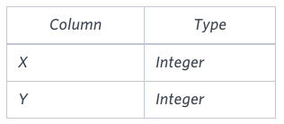

## SQL Quizzes on HackerRank

Liang Sun

This file includes my answers for some of the SQL quizzes on HackerRank.com. I mainly use Oracle SQL commands which can be a little different from My SQL or MS SQL Server queries.

https://www.hackerrank.com/leaderboard?page=1&practice=sql

### 1. Print Prime Numbers

Write a query to print all prime numbers less than or equal to 1000. Print your result on a single line, and use the ampersand () character as your separator (instead of a space).

For example, the output for all prime numbers $\leq$ 10 would be:

2&3&5&7

#### My answer:

```SQL
SELECT LISTAGG(PRIME_NUMBER,'&') WITHIN GROUP (ORDER BY PRIME_NUMBER)
FROM(
SELECT L PRIME_NUMBER
FROM(
SELECT LEVEL L
FROM DUAL
CONNECT BY LEVEL <= 1000),
(SELECT LEVEL M FROM DUAL CONNECT BY LEVEL <= 1000)
WHERE M <= L
GROUP BY L
HAVING COUNT(CASE WHEN L/M = TRUNC(L/M) THEN 'Y' END) = 2
ORDER BY L);

```

#### Testcase output:

```md
2&3&5&7&11&13&17&19&23&29&31&37&41&43&47&53&59&61&67&71&73&79&83&89&97&101&103&107&109&113&127&131&137&139&149&151&157&163&167&173&179&181&191&193&197&199&211&223&227&229&233&239&241&251&257&263&269&271&277&281&283&293&307&311&313&317&331&337&347&349&353&359&367&373&379&383&389&397&401&409&419&421&431&433&439&443&449&457&461&463&467&479&487&491&499&503&509&521&523&541&547&557&563&569&571&577&587&593&599&601&607&613&617&619&631&641&643&647&653&659&661&673&677&683&691&701&709&719&727&733&739&743&751&757&761&769&773&787&797&809&811&821&823&827&829&839&853&857&859&863&877&881&883&887&907&911&919&929&937&941&947&953&967&971&977&983&991&997
```

### 2. The Report

You are given two tables: Students and Grades. Students contains three columns ID, Name and Marks.


Grades contains the following data:


Ketty gives Eve a task to generate a report containing three columns: Name, Grade and Mark. Ketty doesn't want the NAMES of those students who received a grade lower than 8. The report must be in descending order by grade -- i.e. higher grades are entered first. If there is more than one student with the same grade (8-10) assigned to them, order those particular students by their name alphabetically. Finally, if the grade is lower than 8, use "NULL" as their name and list them by their grades in descending order. If there is more than one student with the same grade (1-7) assigned to them, order those particular students by their marks in ascending order.

Write a query to help Eve.

##### Sample Input


##### Sample Output

```md
Maria 10 99
Jane 9 81
Julia 9 88 
Scarlet 8 78
NULL 7 63
NULL 7 68
```

##### Note

Print "NULL"  as the name if the grade is less than 8.

##### Explanation

Consider the following table with the grades assigned to the students:


So, the following students got 8, 9 or 10 grades:

- Maria (grade 10)
- Jane (grade 9)
- Julia (grade 9)
- Scarlet (grade 8)

#### My answer:

``` SQL
SELECT (CASE WHEN GRADE <8 THEN 'NULL' ELSE NAME END) AS NAME, GRADE, MARKS
FROM (
SELECT ID, NAME, MARKS,(CASE
    WHEN MARKS >= 0 AND MARKS <= 9 THEN 1
    WHEN MARKS >= 10 AND MARKS <= 19 THEN 2
    WHEN MARKS >= 20 AND MARKS <= 29 THEN 3
    WHEN MARKS >= 30 AND MARKS <= 39 THEN 4
    WHEN MARKS >= 40 AND MARKS <= 49 THEN 5
    WHEN MARKS >= 50 AND MARKS <= 59 THEN 6
    WHEN MARKS >= 60 AND MARKS <= 69 THEN 7
    WHEN MARKS >= 70 AND MARKS <= 79 THEN 8
    WHEN MARKS >= 80 AND MARKS <= 89 THEN 9
    ELSE 10 END) AS GRADE
FROM STUDENTS)
ORDER BY GRADE DESC,
    CASE WHEN GRADE >= 8 AND GRADE <= 10 THEN GRADE END DESC,
    CASE WHEN GRADE >= 8 AND GRADE <= 10 THEN NAME END ASC,
    CASE WHEN GRADE >= 1 AND GRADE <= 7 THEN MARKS END ASC;

```

####  Testcase output:

```md
Britney 10 95 
Heraldo 10 94 
Julia 10 96 
Kristeen 10 100 
Stuart 10 99 
Amina 9 89 
Christene 9 88 
Salma 9 81 
Samantha 9 87 
Scarlet 9 80 
Vivek 9 84 
Aamina 8 77 
Belvet 8 78 
Paige 8 74 
Priya 8 76 
Priyanka 8 77 
NULL 7 64 
NULL 7 66 
NULL 6 55 
NULL 4 34 
NULL 3 24 
```

### 3. Top Competitors

Julia just finished conducting a coding contest, and she needs your help assembling the leaderboard! Write a query to print the respective hacker_id and name of hackers who achieved full scores for more than one challenge. Order your output in descending order by the total number of challenges in which the hacker earned a full score. If more than one hacker received full scores in same number of challenges, then sort them by ascending hacker_id.

----

##### Input Format

The following tables contain contest data:

Hackers: The hacker_id is the id of the hacker, and name is the name of the hacker. 


Difficulty: The difficult_level is the level of difficulty of the challenge, and score is the score of the challenge for the difficulty level. 


Challenges: The challenge_id is the id of the challenge, the hacker_id is the id of the hacker who created the challenge, and difficulty_level is the level of difficulty of the challenge. 


Submissions: The submission_id is the id of the submission, hacker_id is the id of the hacker who made the submission, challenge_id is the id of the challenge that the submission belongs to, and score is the score of the submission. 


----

##### Sample Input

Hackers Table: 

Difficulty Table: 

Challenges Table: 

Submissions Table: 

---

##### Sample Output
```md
90411 Joe
```

##### Explanation

Hacker 86870 got a score of 30 for challenge 71055 with a difficulty level of 2, so 86870 earned a full score for this challenge.

Hacker 90411 got a score of 30 for challenge 71055 with a difficulty level of 2, so 90411 earned a full score for this challenge.

Hacker 90411 got a score of 100 for challenge 66730 with a difficulty level of 6, so 90411 earned a full score for this challenge.

Only hacker 90411 managed to earn a full score for more than one challenge, so we print the their hacker_id and name as  space-separated values.

#### My answer

```SQL
SELECT HACKER_ID, NAME
FROM(
SELECT HACKER_ID, NAME, COUNT(CHALLENGE_ID) AS COUNT_C
FROM(
SELECT T2.HACKER_ID, T2.NAME, T2.CHALLENGE_ID
FROM(
SELECT T1.HACKER_ID, T1.NAME, T1.SCORE, T1.CHALLENGE_ID, C.DIFFICULTY_LEVEL
FROM (
SELECT H.HACKER_ID, H.NAME, S.CHALLENGE_ID, S.SCORE
FROM HACKERS H
JOIN SUBMISSIONS S
ON H.HACKER_ID = S.HACKER_ID) T1
JOIN CHALLENGES C
ON T1.CHALLENGE_ID = C.CHALLENGE_ID) T2
JOIN DIFFICULTY D
ON T2.DIFFICULTY_LEVEL = D.DIFFICULTY_LEVEL
WHERE T2.SCORE = D.SCORE)
HAVING COUNT(CHALLENGE_ID) > 1
GROUP BY HACKER_ID, NAME
ORDER BY COUNT_C DESC, HACKER_ID ASC);


```

#### Testcase output
```md
27232 Phillip 
28614 Willie 
15719 Christina 
43892 Roy 
14246 David 
14372 Michelle 
18330 Lawrence 
26133 Jacqueline 
26253 John 
30128 Brandon 
35583 Norma 
13944 Victor 
17295 Elizabeth 
19076 Matthew 
26895 Evelyn 
32172 Jonathan 
41293 Robin 
45386 Christina 
45785 Jesse 
49652 Christine 
13391 Robin 
14366 Donna 
14777 Gerald 
16259 Brandon 
17762 Joseph 
28275 Debra 
36228 Nancy 
37704 Keith 
40226 Anna 
49307 Brian 
12539 Paul 
14363 Joyce 
14658 Stephanie 
19448 Jesse 
20504 John 
20534 Martha 
22196 Anthony 
23678 Kimberly 
28299 David 
30721 Ann 
32254 Dorothy 
46205 Joyce 
47641 Patricia 
13122 James 
13762 Gloria 
14863 Walter 
18690 Marilyn 
18983 Lori 
21212 Timothy 
25732 Antonio 
28250 Evelyn 
30755 Emily 
38852 Benjamin 
42052 Andrew 
44188 Diana 
48984 Gregory 
13380 Kelly 
13523 Ralph 
21463 Christine 
24663 Louise 
26243 Diana 
26289 Dorothy 
39277 Charles 
23278 Paula 
25184 Martin 
32121 Dorothy 
36322 Andrew 
39782 Tammy 
40257 James 
41319 Jean 
10857 Kevin 
25238 Paul 
34242 Marilyn 
39771 Alan 
49789 Lillian 
57947 Justin 
74413 Harry 
```

### 4. Draw The Triangle

P(R) represents a pattern drawn by Julia in R rows. The following pattern represents P(5):

```
* * * * * 
* * * * 
* * * 
* * 
*
```

Write a query to print the pattern P(20).

#### My answer:
```SQL
SELECT SUBSTR(RPAD('* ', 40, '* '), 1, (42 - LEVEL * 2))  
FROM DUAL 
CONNECT BY LEVEL <= 20;
```

RPAD() function returns a string that is right-padded with a specified string to a certain length. 

DUAL table is a special one-row, one-column table present by default in Oracle and other database installation. It has a single VARCHAR2(1) column called DUMMY that has a value of 'X'. It is suitable for us in slecting a pseudo column such as SYSDATE or USER.

#### Testcase output:
```
* * * * * * * * * * * * * * * * * * * * 
* * * * * * * * * * * * * * * * * * * 
* * * * * * * * * * * * * * * * * * 
* * * * * * * * * * * * * * * * * 
* * * * * * * * * * * * * * * * 
* * * * * * * * * * * * * * * 
* * * * * * * * * * * * * * 
* * * * * * * * * * * * * 
* * * * * * * * * * * * 
* * * * * * * * * * * 
* * * * * * * * * * 
* * * * * * * * * 
* * * * * * * * 
* * * * * * * 
* * * * * * 
* * * * * 
* * * * 
* * * 
* * 
*  
```

### 5. Ollivander's Inventory
(My favorite quiz because it is Harry Potter!)

Harry Potter and his friends are at Ollivander's with Ron, finally replacing Charlie's old broken wand.

Hermione decides the best way to choose is by determining the minimum number of gold galleons needed to buy each non-evil wand of high power and age. Write a query to print the id, age, coins_needed, and power of the wands that Ron's interested in, sorted in order of descending power. If more than one wand has same power, sort the result in order of descending age.

##### Input Format

The following tables contain data on the wands in Ollivander's inventory:

Wands: The id is the id of the wand, code is the code of the wand, coins_needed is the total number of gold galleons needed to buy the wand, and power denotes the quality of the wand (the higher the power, the better the wand is). 


Wands_Property: The code is the code of the wand, age is the age of the wand, and is_evil denotes whether the wand is good for the dark arts. If the value of is_evil is 0, it means that the wand is not evil. The mapping between code and age is one-one, meaning that if there are two pairs,  and , then  and .


##### Sample Input

Wands Table: Wands_Property Table: 


##### Sample Output
```
9 45 1647 10
12 17 9897 10
1 20 3688 8
15 40 6018 7
19 20 7651 6
11 40 7587 5
10 20 504 5
18 40 3312 3
20 17 5689 3
5 45 6020 2
14 40 5408 1
```

##### Explanation

The data for wands of age 45 (code 1): 


The minimum number of galleons needed for $wand(age = 45, power = 2) = 6020$

The minimum number of galleons needed for $wand(age = 45, power = 10) = 1647$

The data for wands of age 40 (code 2): 


The minimum number of galleons needed for $wand(age = 40, power = 1) = 5408$

The minimum number of galleons needed for $wand(age = 40, power = 3) = 3312$

The minimum number of galleons needed for $wand(age = 40, power = 5) = 7587$

The minimum number of galleons needed for $wand(age = 40, power = 7) = 6018$

The data for wands of age 20 (code 4): 


The minimum number of galleons needed for $wand(age = 20, power = 5) = 504$

The minimum number of galleons needed for $wand(age = 20, power = 6) = 7651$

The minimum number of galleons needed for $wand(age = 20, power = 8) = 3688$

The data for wands of age 17 (code 5): 


The minimum number of galleons needed for $wand(age = 17, power = 3) = 5689$

The minimum number of galleons needed for $wand(age = 17, power = 10) = 9897$

#### My answer:

```SQL
SELECT T1.ID, T2.AGE, T2.MIN_PRICE, T2.POWER
FROM WANDS T1
INNER JOIN
(SELECT MIN(W.COINS_NEEDED) AS MIN_PRICE, W.POWER, P.AGE, P.CODE
FROM WANDS W
INNER JOIN WANDS_PROPERTY P
ON W.CODE = P.CODE
WHERE P.IS_EVIL = 0
GROUP BY W.POWER, P.AGE, P.CODE) T2
ON T1.CODE = T2.CODE AND T1.POWER = T2.POWER AND T1.COINS_NEEDED = T2.MIN_PRICE
ORDER BY T2.POWER DESC, T2.AGE DESC;
```

#### Testcase output (too long; take a sample):

```
1038 496 4789 10 
1130 494 9439 10 
1315 492 4126 10 
9 491 7345 10 
858 483 4352 10 
1164 481 9831 10 
1288 464 4952 10 
861 462 8302 10 
412 455 5625 10 
996 451 8884 10 
1608 446 8351 10 
1376 443 1735 10 
1330 430 5182 10 
1633 425 2206 10 
1197 419 3468 10 
441 416 2508 10 
424 413 997 10 
1298 397 3810 10 
1125 395 2299 10 
333 393 926 10 
363 388 4477 10 
785 380 1712 10 
1578 376 9886 10 
455 375 2759 10 
238 374 2016 10 
421 367 4392 10 
346 349 1909 10 
874 348 7212 10 
483 344 8855 10 
1485 340 741 10 
1583 339 3867 10 
983 337 851 10 
185 335 618 10 
1325 318 520 10 
1938 311 2726 10 
1121 310 6498 10 
1773 308 3489 10 
999 301 7322 10 
1456 286 6221 10 
405 284 1187 10 
1903 283 5954 10 
114 279 7915 10 
525 278 3247 10 
707 275 8110 10 
1040 271 4993 10 
1655 264 2027 10 
266 263 2106 10 
1520 259 2533 10 
426 255 9950 10 
1214 254 3927 10 
1161 240 4875 10 
470 235 1794 10 

```

### 6. Type of Triangle

Write a query identifying the type of each record in the TRIANGLES table using its three side lengths. Output one of the following statements for each record in the table:

Equilateral: It's a triangle with 3 sides of equal length.
Isosceles: It's a triangle with 2 sides of equal length.
Scalene: It's a triangle with 3 sides of differing lengths.
Not A Triangle: The given values of A, B, and C don't form a triangle.
Input Format

The TRIANGLES table is described as follows:


Each row in the table denotes the lengths of each of a triangle's three sides.

##### Sample Input


##### Sample Output
```
Isosceles
Equilateral
Scalene
Not A Triangle
Explanation
```
Values in the tuple (20, 20, 23) form an Isosceles triangle, because A ≡ B. 

Values in the tuple (20, 20, 20) form an Equilateral triangle, because A ≡ B ≡ C. Values in the tuple (20, 21, 22) form a Scalene triangle, because A $\neq$ B $\neq$ C. 

Values in the tuple (13, 14, 30) cannot form a triangle because the combined value of sides A and B is not larger than that of side C.


#### My answer:
```SQL
SELECT CASE WHEN 2 * GREATEST(A, B, C) >= A + B + C THEN 'Not A Triangle'
            WHEN A = B AND B = C THEN 'Equilateral'
            WHEN A = B OR B = C OR A = C THEN 'Isosceles'
            ELSE 'Scalene'
            END
FROM TRIANGLES;
```

CASE WHEN evaluates in the order conditions are listed. Once a condition is true, the CASE function will return the result and not evaluate the conditions any further.

#### Testcase output:

```
Equilateral 
Equilateral 
Isosceles 
Equilateral 
Isosceles 
Equilateral 
Scalene 
Not A Triangle 
Scalene 
Scalene 
Scalene 
Not A Triangle 
Not A Triangle 
Scalene 
Equilateral 
```

### 7. New Companies

You are given a table, Projects, containing three columns: Task_ID, Start_Date and End_Date. It is guaranteed that the difference between the End_Date and the Start_Date is equal to 1 day for each row in the table.


If the End_Date of the tasks are consecutive, then they are part of the same project. Samantha is interested in finding the total number of different projects completed.

Write a query to output the start and end dates of projects listed by the number of days it took to complete the project in ascending order. If there is more than one project that have the same number of completion days, then order by the start date of the project.

##### Sample Input


##### Sample Output
```
2015-10-28 2015-10-29
2015-10-30 2015-10-31
2015-10-13 2015-10-15
2015-10-01 2015-10-04
```

##### Explanation

The example describes following four projects:

Project 1: Tasks 1, 2 and 3 are completed on consecutive days, so these are part of the project. Thus start date of project is 2015-10-01 and end date is 2015-10-04, so it took 3 days to complete the project.

Project 2: Tasks 4 and 5 are completed on consecutive days, so these are part of the project. Thus, the start date of project is 2015-10-13 and end date is 2015-10-15, so it took 2 days to complete the project.

Project 3: Only task 6 is part of the project. Thus, the start date of project is 2015-10-28 and end date is 2015-10-29, so it took 1 day to complete the project.

Project 4: Only task 7 is part of the project. Thus, the start date of project is 2015-10-30 and end date is 2015-10-31, so it took 1 day to complete the project.

#### My answer:

Generate a fake id row number, and it can be observed that the difference between start date and row number should be the same for all the dates within a project; thus we can group the dates based on such differences.

```SQL
SELECT MIN_D, MAX_D
FROM (
SELECT MIN(START_DATE) MIN_D, MAX(END_DATE) MAX_D, COUNT(DIFF) COUNT_DAYS
FROM
(SELECT ROW_NUMBER() OVER(ORDER BY END_DATE) AS ROW_N, START_DATE, END_DATE, 
START_DATE - ROW_NUMBER() OVER (ORDER BY END_DATE) AS DIFF
FROM PROJECTS)
GROUP BY DIFF)
ORDER BY COUNT_DAYS ASC, MIN_D ASC;
```


#### Testcase output:

```
2015-10-15 2015-10-16 
2015-10-17 2015-10-18 
2015-10-19 2015-10-20 
2015-10-21 2015-10-22 
2015-11-01 2015-11-02 
2015-11-17 2015-11-18 
2015-10-11 2015-10-13 
2015-11-11 2015-11-13 
2015-10-01 2015-10-05 
2015-11-04 2015-11-08 
2015-10-25 2015-10-31 
```

### 8. Symmetric Pairs

You are given a table, Functions, containing two columns: X and Y.



Two pairs (X1, Y1) and (X2, Y2) are said to be symmetric pairs if X1 = Y2 and X2 = Y1.

Write a query to output all such symmetric pairs in ascending order by the value of X.

##### Sample Input


##### Sample Output
```
20 20
20 21
22 23
```

#### My answer:
```SQL
SELECT DISTINCT X, Y
FROM (
SELECT T0.X, T0.Y
FROM FUNCTIONS T0
INNER JOIN(
SELECT T1.X, T1.Y, T2.SUM_XY
FROM (
SELECT X, Y, X+Y AS S_XY
FROM FUNCTIONS) T1
INNER JOIN
(SELECT X+Y AS SUM_XY, COUNT(X+Y) AS COUNT_SAME
FROM FUNCTIONS 
GROUP BY X+Y
HAVING COUNT(X+Y) > 1) T2
ON T1.S_XY = T2.SUM_XY) T3
ON T0.X= T3.Y AND T0.Y = T3.X)
WHERE X<Y OR X=Y
ORDER BY X;
```

#### Testcase output:
``` MD
2 24 
4 22 
5 21 
6 20 
8 18 
9 17 
11 15 
13 13
```
